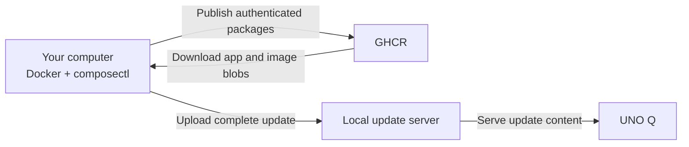

# Use GitHub Container Registry for the UNO Q Example

GitHub Container Registry (GHCR) is one option for packaging applications in the
[UNO Q setup guide](../application-updates.md#package-and-deliver-shellhttpd-version-1).
Use this page if you do not already have a suitable Open Container Initiative (OCI) registry.

You will publish two packages:

| Package | Purpose |
| --- | --- |
| `ghcr.io/YOUR_USERNAME/unoq-shellhttpd-image` | The ARM64 container image built from the Foundries example |
| `ghcr.io/YOUR_USERNAME/shellhttpd` | The Compose application that references the image by digest |

The optional [second-application exercise](../application-updates.md#add-a-second-application-without-updating-the-os)
also publishes `ghcr.io/YOUR_USERNAME/statushttpd`.
It reuses the existing container image and runs as a separate Compose app on board port 8081.

The packaging computer downloads both packages into the update directory.
The local update server then serves the uploaded content to the UNO Q.
The board needs no GitHub account or GHCR token for this workflow.



## Create a Package Token

Sign in to GitHub and create a **personal access token (classic)** following
[GitHub's Container registry authentication instructions](https://docs.github.com/en/packages/working-with-a-github-packages-registry/working-with-the-container-registry#authenticating-with-a-personal-access-token-classic).
Use `write:packages` for publishing and confirm read access for downloading the packages.
Set an expiration appropriate for your lab work.

If your organization requires single sign-on (SSO), authorize the token for that organization.
This example uses your personal namespace; an organization namespace requires permission to publish packages there.

Keep the token available for the two password prompts below.
Enter the token rather than your GitHub account password.

## Choose Package Names

Run these commands in the **same local host Bash shell** used for the main guide.
On Windows, use the Ubuntu shell in Windows Subsystem for Linux® (WSL), with Docker Desktop integration enabled.
Replace the username with your lowercase GitHub username:

```bash
export REGISTRY_USER='your-lowercase-github-username'
export REGISTRY_PREFIX="ghcr.io/$REGISTRY_USER"
export IMAGE_REPO="$REGISTRY_PREFIX/unoq-shellhttpd-image"
export IMAGE_REF="$IMAGE_REPO:v1"
export APP_REPO="$REGISTRY_PREFIX/shellhttpd"
```

Keep the final Compose app name `shellhttpd`.
The main guide selects that name on the device.
These variables are shell-local; repeat this block if you open a new terminal.

## Authenticate the Image Build

Log in with the host Docker client:

```bash
docker login ghcr.io --username "$REGISTRY_USER"
```

Paste your token at the password prompt.
Wait for `Login Succeeded`.
This login allows `docker buildx build --push` to upload the example's container image.

## Authenticate the Compose Packaging Tools

The main guide runs `composectl` in a tools container.
Docker Desktop's native credential helper is unavailable there, so provide a separate Docker authentication file.

From the guide directory, with `GUIDE_DIR` already set:

```bash
mkdir -p "$GUIDE_DIR/.registry-auth"
chmod 700 "$GUIDE_DIR/.registry-auth"
if [ ! -e "$GUIDE_DIR/.registry-auth/config.json" ]; then
  printf '{"auths":{}}\n' > "$GUIDE_DIR/.registry-auth/config.json"
fi
chmod 600 "$GUIDE_DIR/.registry-auth/config.json"
docker --config "$GUIDE_DIR/.registry-auth" login ghcr.io --username "$REGISTRY_USER"
```

Enter the same token at the password prompt.
The tools container mounts this directory read-only and uses it for `composectl publish` and `composectl pull`.
The file contains credentials; keep it out of shared archives and update payloads.
The companion `.gitignore` already excludes it.

## Choose Package Visibility

GHCR initially creates packages as private.
They can remain private for the main guide because the packaging computer authenticates to download all required content.

If you want others to pull the example without credentials, make **both** packages public after their first publication:

1. Open your GitHub profile's **Packages** tab.
2. Select the package and open **Package settings**.
3. Change its visibility to public using GitHub's confirmation flow.
4. Repeat for the other package.

If you complete the second-application exercise, apply your chosen visibility to its `statushttpd` package as well.

Changing visibility is optional and publishes those package contents to others.
See [GitHub's package access and visibility guidance](https://docs.github.com/en/packages/learn-github-packages/configuring-a-packages-access-control-and-visibility).

## Return to the UNO Q Guide

Continue at **[Build the existing Foundries example](../application-updates.md#build-the-existing-foundries-example)**.
Your shell now has `IMAGE_REPO`, `IMAGE_REF`, and `APP_REPO`, and both Docker and the packaging tools have credentials.

If publishing fails with an authorization error, check the lowercase namespace, token expiration, package permissions, and SSO authorization.
